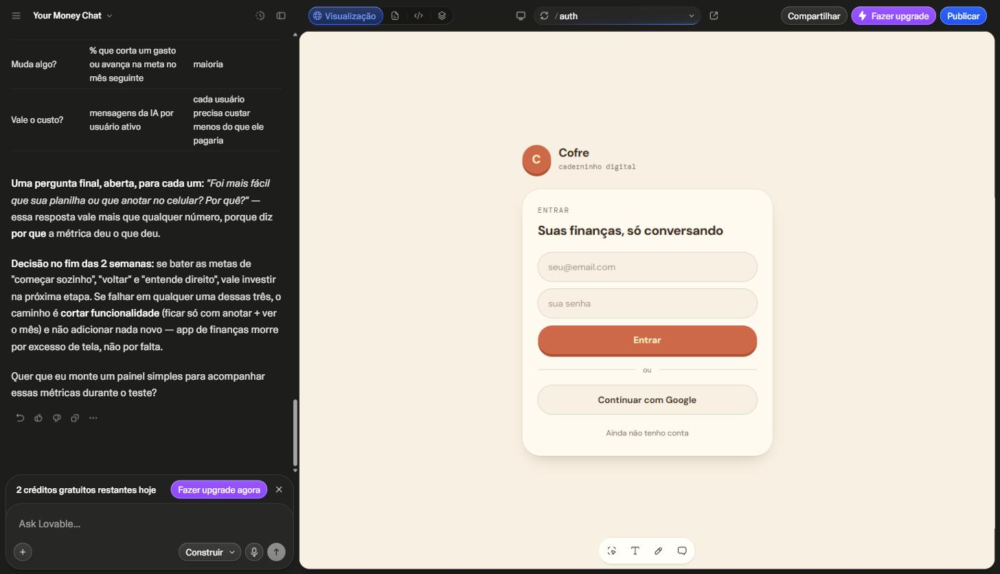
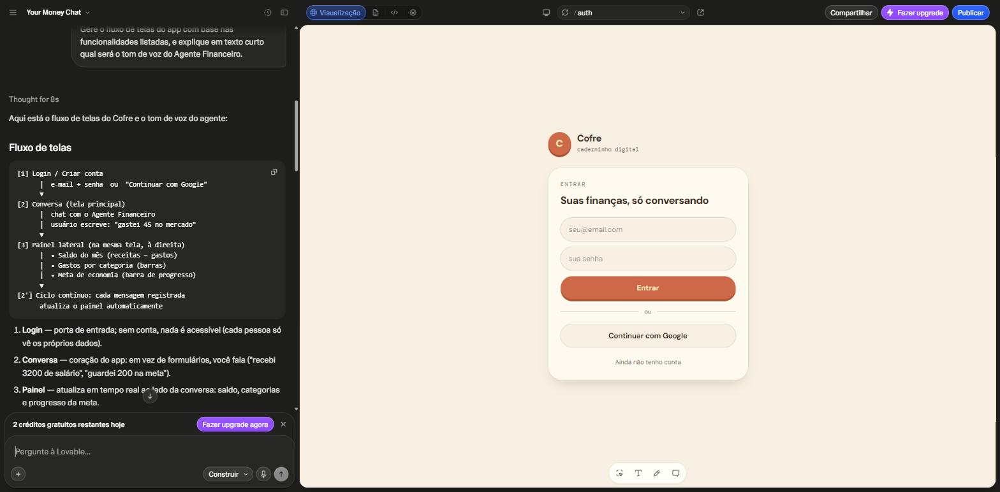
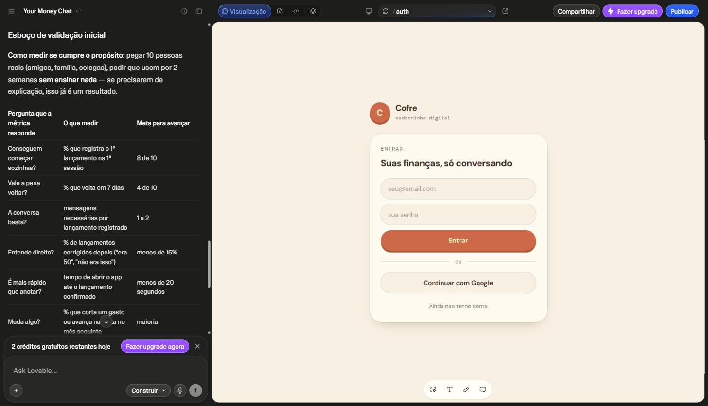

# 💸 FinZen — App de Organização de Finanças Pessoais com Vibe Coding

Projeto conceitual criado no desafio **Vibe Coding** da DIO (trilha Riachuelo — Criando Produtos com IA), a partir do repositório-base [dio-lab-vibe-coding-app-financas](https://github.com/digitalinnovationone/dio-lab-vibe-coding-app-financas).

---

## 📌 Resumo do App

**FinZen** é o conceito de um app de organização de finanças pessoais que funciona por conversa: o usuário registra gastos e tira dúvidas sobre suas próprias finanças em linguagem natural, sem preencher planilhas ou formulários longos. Um "Agente Financeiro" categoriza as transações automaticamente, acompanha metas de orçamento e entrega, toda semana, um resumo em texto simples com sugestões de economia — tirando do usuário o trabalho manual que faz a maioria das pessoas desistir de controlar as finanças.

**Funcionalidades-chave do MVP:**

1. Registrar gastos via chat em linguagem natural.
2. Classificar automaticamente as transações por categoria.
3. Definir e acompanhar metas financeiras por categoria.
4. Receber dicas de economia do "Agente Financeiro" (resumo semanal).
5. Visualizar relatórios simples e personalizados (dashboard enxuto).

---

## 🧠 Prompt Final (PRD)

```
# Contexto
Quero criar um aplicativo de Organização de Finanças Pessoais que funcione por meio de conversas com o usuário.
A ideia é facilitar o controle financeiro de forma simples e natural, sem formulários manuais ou planilhas complexas.

# Problema
Muitas pessoas desistem de controlar seus gastos porque os apps atuais exigem muita entrada manual e pouca personalização.
Quero resolver isso com uma experiência de conversa e recomendações automáticas de economia.

# Público-Alvo
Pessoas que querem começar a organizar suas finanças de forma prática e sem complicação, principalmente iniciantes.

# Funcionalidades-Chave
1. Registrar gastos via chat em linguagem natural.
2. Classificar automaticamente as transações.
3. Definir e acompanhar metas financeiras.
4. Receber dicas de economia do "Agente Financeiro".
5. Visualizar relatórios simples e personalizados.

# Entregável da IA
Gerar um plano de MVP com as principais telas, recursos necessários e um esboço de validação inicial.
Usar tom educativo e linguagem acessível, em português.
```

---

## 💬 Interações com a IA

> Interação real feita no Lovable a partir do prompt acima (projeto "Your Money Chat"), em 3 rodadas de conversa: (1) prompt do PRD → geração do app; (2) pedido do fluxo de telas + tom de voz do agente; (3) pedido do plano de MVP resumido e validação inicial.

### 1ª interação — geração do app a partir do PRD

O Lovable interpretou o PRD e gerou um app funcional chamado **"Cofre"** (caderninho digital), com login por e-mail/Google e uma tela de conversa para registrar gastos:



### 2ª interação — fluxo de telas e tom de voz do Agente Financeiro

Pedido: *"Gere o fluxo de telas do app com base nas funcionalidades listadas, e explique em texto curto qual será o tom de voz do Agente Financeiro."*



Resumo do fluxo gerado: **Login/Criar conta → Conversa (tela principal, chat com o Agente Financeiro) → Painel lateral (saldo do mês, gastos por categoria, meta de economia) → ciclo contínuo**, já que cada mensagem registrada atualiza o painel automaticamente.

Tom de voz definido pela IA: *"Parceiro tranquilo, nunca professor"* — frases curtas, português do dia a dia, zero jargão bancário, confirma o que anotou, comenta com leveza e celebra pequenas vitórias, sem nunca julgar ou dar bronca.

### 3ª interação — plano de MVP e validação inicial

Pedido: *"Gere uma versão resumida do plano de MVP: recursos necessários e um esboço de validação inicial (como medir se o app cumpre seu propósito)."*



**Recursos necessários apontados pela IA:** backend com login e banco próprio, modelo de linguagem para interpretar as mensagens (único custo recorrente real), login do Google configurado, domínio próprio e uma pessoa dedicando ~2 a 4h/semana ao teste — nada de equipe.

**Validação inicial sugerida:** testar com 10 pessoas reais por 2 semanas, sem ensinar nada (se precisarem de explicação, já é um resultado), medindo métricas como % que registra o 1º gasto sozinho (meta: 8 de 10), % que volta em 7 dias (meta: 4 de 10) e tempo para anotar um gasto (meta: menos de 20 segundos). Se as metas não forem batidas, a recomendação da IA é cortar funcionalidade em vez de adicionar mais telas.

---

## 🔎 Reflexão sobre o Processo

**O que funcionou bem:** escrever o PRD antes de pedir qualquer coisa pra IA mudou o resultado — descrever problema, público e funcionalidades logo de início evitou respostas genéricas e manteve as sugestões (fluxo de telas, tom do agente) alinhadas com a intenção original do app.

**O que não funcionou como o esperado:** pedir tudo de uma vez ("cria o app inteiro") tende a gerar respostas rasas; funcionou melhor quebrar o pedido em partes menores (agente, fluxo de telas, plano de MVP) e pedir uma de cada vez, especialmente pensando no limite de interações do plano gratuito do Lovable.

**O que aprendi sobre conversar com IAs:** o formato da pergunta importa tanto quanto o conteúdo — pedir explicitamente "gere o fluxo de telas" ou "resuma em 5 funcionalidades" produz algo acionável, enquanto pedir só "o que você acha da ideia?" produz opinião solta, sem nada que vire de fato um próximo passo do produto.
